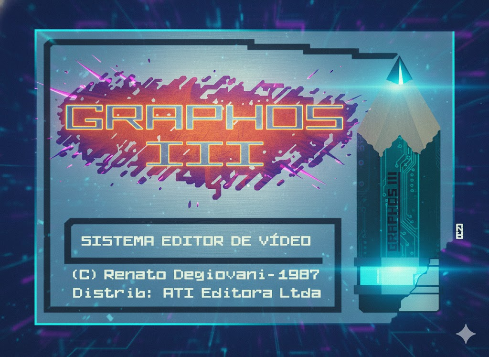
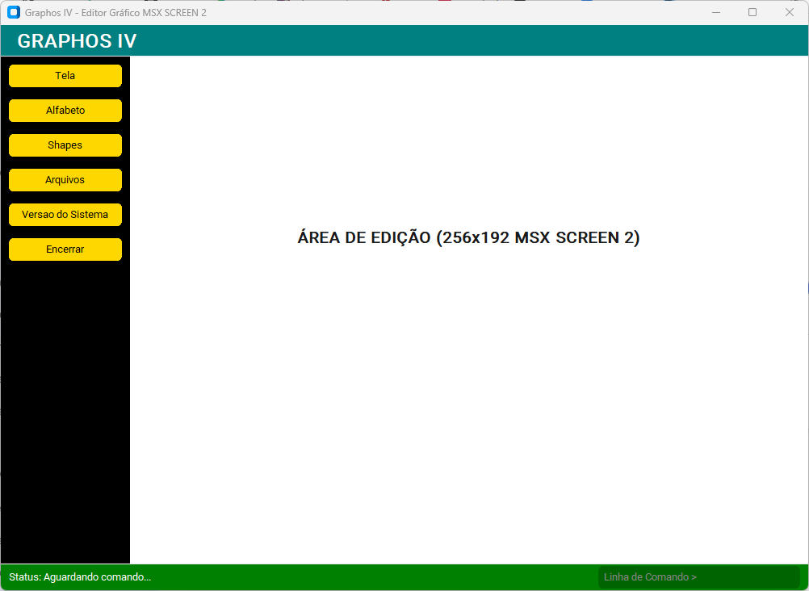
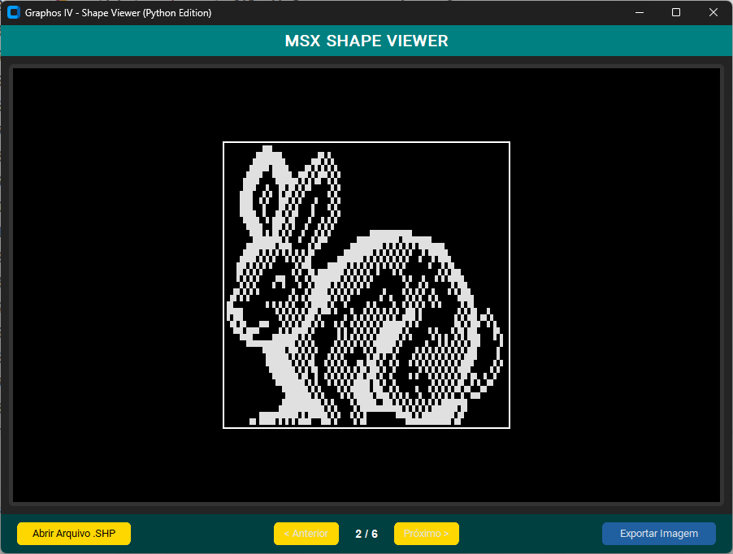
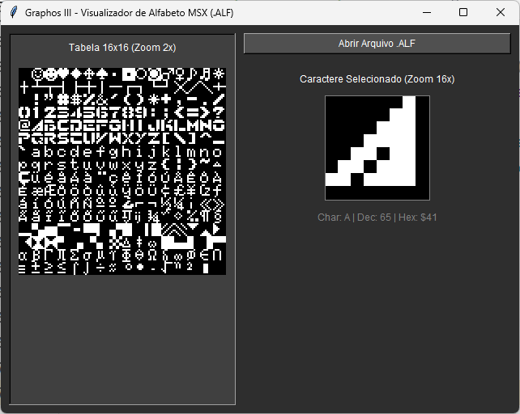
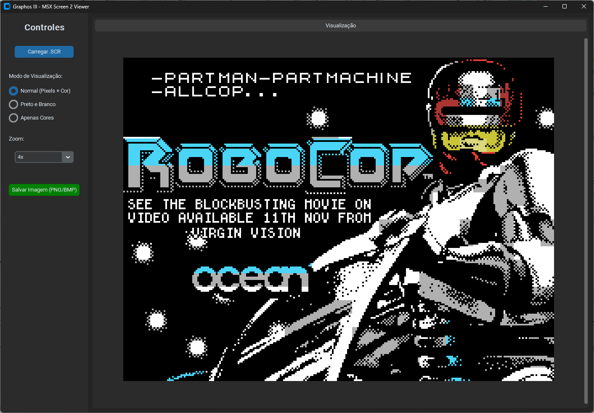
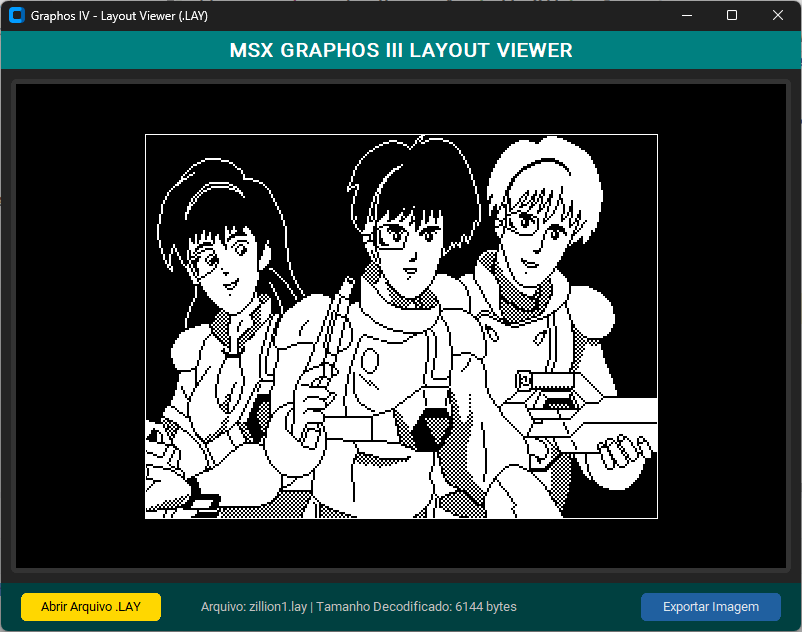

# MSX **Graphos IV** - Suíte de Edição Gráfica (Python Edition)

Um ambiente gráfico moderno, desenvolvido em Python, para criar e visualizar imagens e recursos no formato **SCREEN 2** do MSX. Este projeto é uma homenagem e uma recriação funcional do icônico editor brasileiro **Graphos III** de Renato Degiovani.

## 🚀 Sobre o Projeto

O **Graphos IV** expande o conceito original, não apenas oferecendo um editor de pixels, mas uma suíte de ferramentas para manipular os formatos de arquivo clássicos do Graphos (Shapes, Alfabetos e Telas). O foco permanece nas restrições do MSX1:
* Resolução de **256x192 pixels**.
* Paleta de **16 cores fixas**.
* Restrição de cor: **2 cores por bloco de 8x1 pixels**.

## 🖥️ Graphos IV: O Editor Principal

O arquivo `main.py` carrega a interface principal do sistema, reescrita utilizando **CustomTkinter** para oferecer uma experiência visual moderna ("Dark/Teal Theme") mantendo a ergonomia clássica.

### Estrutura de Menus
O sistema organiza suas funcionalidades em uma árvore de menus hierárquica:
*   **Tela:** Controle de Display (Rotinas A, B, C, D), Edição, Arquivamento e Recuperação de telas completas.
*   **Alfabeto:** Ferramentas para edição e manipulação de conjuntos de caracteres (Fonts 8x8).
*   **Shapes:** Criação e gerenciamento de bibliotecas de *sprites* e blocos gráficos.
*   **Arquivos:** Gerenciamento de disco, importação e exportação de dados.
*   **Versão do Sistema:** Informações sobre a build atual e créditos (Renato Degiovani / Wilson "Barney" Pilon).

---

## 📂 Utilitários de Visualização (Viewers)

O projeto inclui ferramentas independentes para visualizar e converter arquivos legados gerados pelo Graphos III original.

### 1. Visualizador de Shapes (`shapeV_2.py`)
Ferramenta dedicada à leitura de arquivos `.SHP`. O Graphos III utilizava shapes para "carimbar" desenhos na tela.
*   **Funcionalidades:** Navegação entre shapes do arquivo, zoom visual (até 16x) e exportação para PNG/BMP.
*   **Visualização:**

### 2. Visualizador de Alfabeto
Ferramenta para carregar e inspecionar arquivos de fontes (`.ALF`). Permite ver como os caracteres 8x8 customizados foram desenhados.
*   **Visualização:**

### 3. Visualizador de Telas
Carrega "dumps" de tela ou layouts completos (`.SCR` ou formatos proprietários do Graphos). Permite visualizar a arte final pixel-perfect como seria no MSX.
*   **Visualização:**

### 4. Visualizador de Layouts (`layoutV.py`)
Ferramenta especializada na leitura de arquivos de Layout (`.LAY`). Estes arquivos utilizam uma compressão RLE proprietária e contêm apenas informações de padrão (bitmap), sem cor.
*   **Funcionalidades:** Decodificação do algoritmo proprietário do Graphos III e exportação em alta resolução.
*   **Visualização:**

---

## ⚙️ Ferramentas Utilizadas

| Categoria | Ferramenta | Descrição |
| :--- | :--- | :--- |
| **Linguagem** | Python 3.14 | Linguagem base do projeto. |
| **GUI** | CustomTkinter | Interface gráfica moderna e responsiva. |
| **Dados** | SQLite3 | Armazenamento de projetos e metadados. |
| **Imagem** | PIL/Pillow | Manipulação de bits e exportação gráfica. |
| **IA** | Google Gemini | Apoio técnico em especificações VDP e arquitetura. |

## 📜 Referencial Histórico: Graphos III

O Graphos III foi um dos mais notáveis editores gráficos para o MSX brasileiro, criado por **Renato Degiovani**. Foi crucial para a comunidade MSX na década de 80, permitindo que usuários criassem telas de jogos e programas aproveitando ao máximo a restrição gráfica do SCREEN 2.

## 🤖 Suporte de IA

Este projeto conta com o auxílio do modelo de linguagem **Google Gemini** para validação de especificações técnicas do VDP (Video Display Processor) do MSX1, layout de memória da **SCREEN 2** (PNT, PCT, GGT) e otimização de código Python.